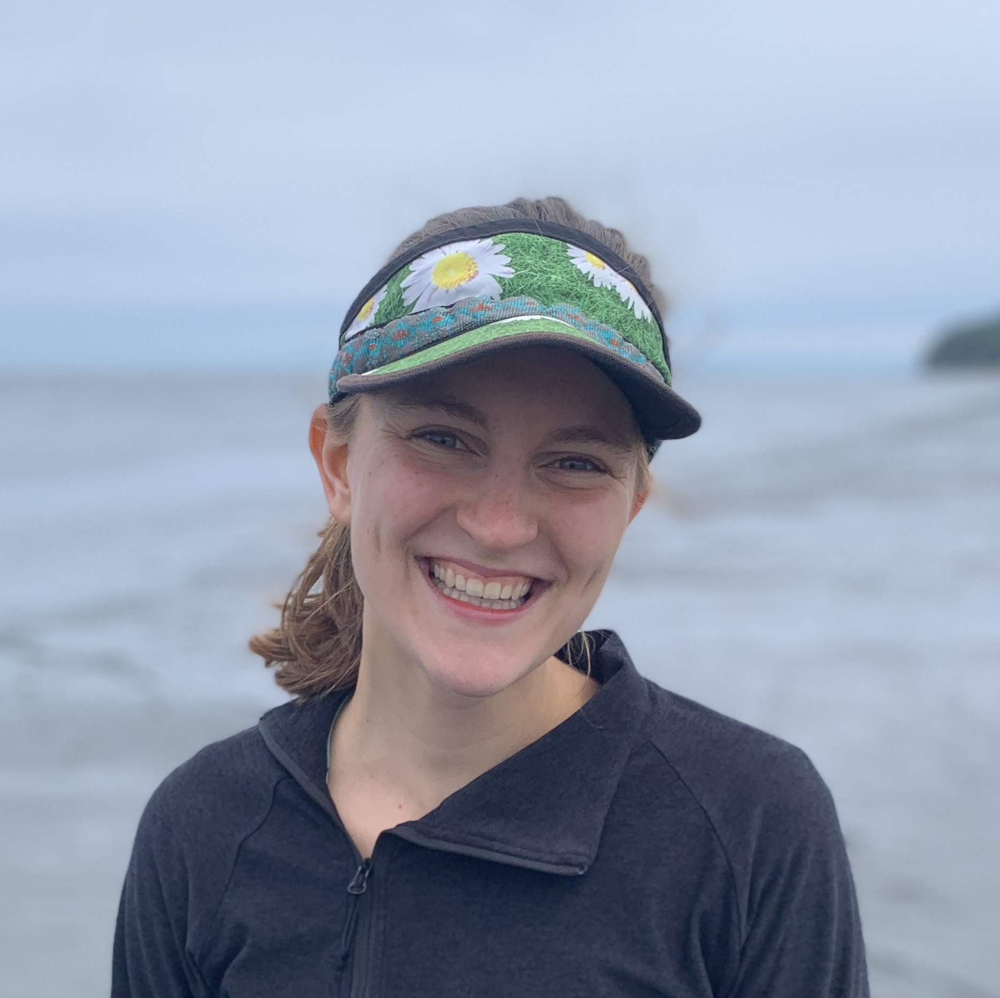

```{r, echo = FALSE, out.width = "150px", out.height= "150px", fig.align = "left"}

```

## 10 fun facts about me!

1. I grew up in Rochester, New York (go Bills!)
2. I played division III soccer at Houghton College in Western New York 
3. I also played division III lacrosse (I was much better at soccer...)
4. I run marathons (Boston Marathon x2, Chicago Marathon, Seattle Marathon, Eugene Marathon, 2020 Virtual Marathon)
5. I met my husband, Alex, in Knoxville, Tennessee and we eloped in Coeur D'alene, Idaho in 2021
6. We adopted our dog Bandy (named after Bandy Creek campground in Big South Fork) in 2022
7. Although I am a quantitative ecologist, I absolutely love opportunities to get in the field! 
8. I became interested in aquatic invasive species at a young age when my cousins and I used to scrape zebra mussels off rocks at the bottom of Skaneateles Lake, NY 
9. Sturgeon are my favorite type of fish!
10. My favorite type of water body ranking is: River > Lake > Ocean


