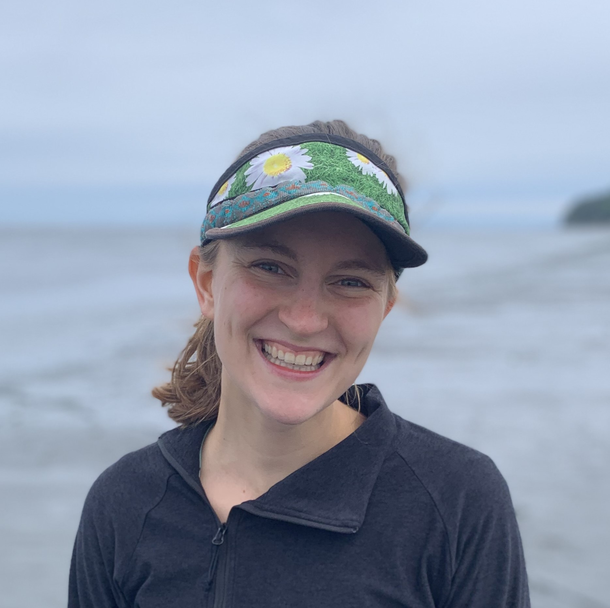
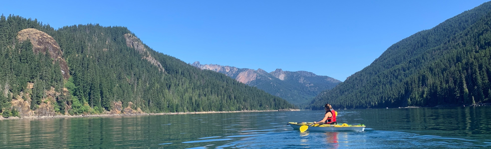

```{r, echo = FALSE, out.width = "200px", out.height= "200px"}

```


Hi! I am a graduate student at the University of Washington in the Quantitative Ecology and Resource Management (QERM) program. 

My graduate research involves applying mathematical, statistical, and geospatial models to better inform invasive species management.  

I am co-advised by [Dr. Julian Olden](http://depts.washington.edu/oldenlab/) and [Dr. Sarah Converse](http://depts.washington.edu/qcons/).  


Outside of research you can find me running the streets and greenways of Seattle, WA, and hiking, backpacking, and kayaking throughout the PNW.  

Feel free to contact me at bkwarta@uw.edu for any questions regarding the QERM program or my research. 

```{r, echo = FALSE}

```
