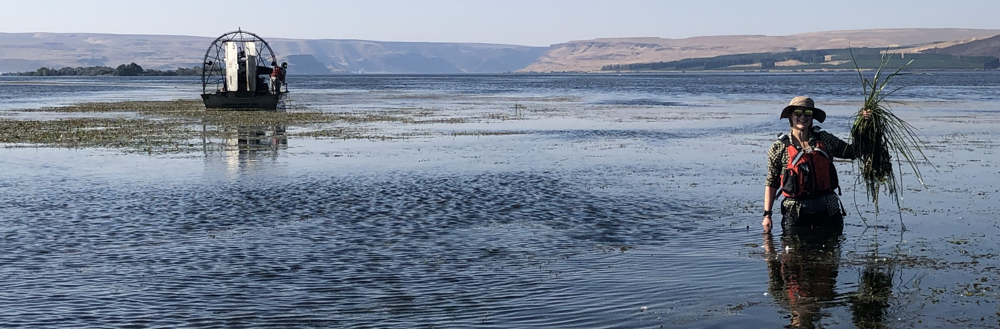

```{r, echo = FALSE}

```

<center>
# Welcome !
</center>

I am a postdoctoral fellow in the Missouri Cooperative Fish and Wildlife Research Unit at the University of Missouri (aka Mizzou). I currently work with [Dr. Craig Paukert](http://www.riverstudies.com/) (Mizzou) and [Dr. Mike Colvin](https://www.usgs.gov/staff-profiles/mike-colvin) (USGS) to apply quantitative population models and decision analysis tools to better inform invasive carp management in North America. One of my projects involves developing an early detection framework for Prussian carp (a new carp invader currently in Canada!). I am developing both coarse and fine spatial grain models to inform eDNA sampling locations across the US border. 

### Education:
* **Ph.D.** in Quantitative ecology and Resource Management (QERM), **University of Washington**, June 2024
  + Co-advised by [Dr. Julian Olden](http://depts.washington.edu/oldenlab/) and [Dr. Sarah Converse](http://depts.washington.edu/qcons/).
* **B.A.** in Mathematics (minors: Biology, Education) **Houghton College**, December 2018

### Research interests:
* Quantitative ecology
* Invasive species management
* Decision analysis (Structured Decision Making, adaptive management)
* Game theory applications to natural resource management
* Bayesian statistics
* [(CV)](BrielleKThompson_CV_2025.pdf) 

Feel free to contact me at brielle.thompson@missouri.edu for any questions regarding my research or experience in the QERM program at the University of Washington.
