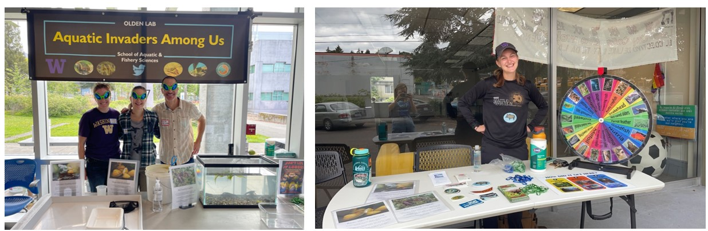

I am extremely passionate about public engagement and science outreach. Engagement and outreach can help build public trust in our research, inspire the next generation of scientists, and provide scientists with fresh perspectives and insights. 

Below are some public engagement and outreach organizations that I have had a role in:

* [STEM CUBS](https://provost.missouri.edu/stem-cubs/) – University of Missouri. Role: Volunteer for K-1st grade STEM teaching activities

* [Students Explore Aquatic Science](https://fish.uw.edu/students/student-organizations/students-explore-aquatic-sciences-seas/) - University of Washington. Roles: Student board member, classroom lesson developer, community event volunteer, annual open house volunteer and organizer 


* [National Ocean Sciences Bowl](https://nosb.org/) – Washington Sea Grant. Roles: Competition official 

* [NIMBioS Middle School STEM Camp for Girls](https://legacy.nimbios.org/wordpress/2019/07/01/stem-adventures-for-middle-school-girls/) – University of Tennessee. Role: Counselor

*	YWCA and YMCA – Knoxville, TN. Role: STEM tutor

* Houghton Academy International High School – Houghton, NY. Role: STEM tutor and English as a second language (ESL) tutor 

* YMCA Camp Arrowhead – Pittsford, NY. Role: STEM camp counselor and middle school lesson development lead

```{r, echo = FALSE}

```

